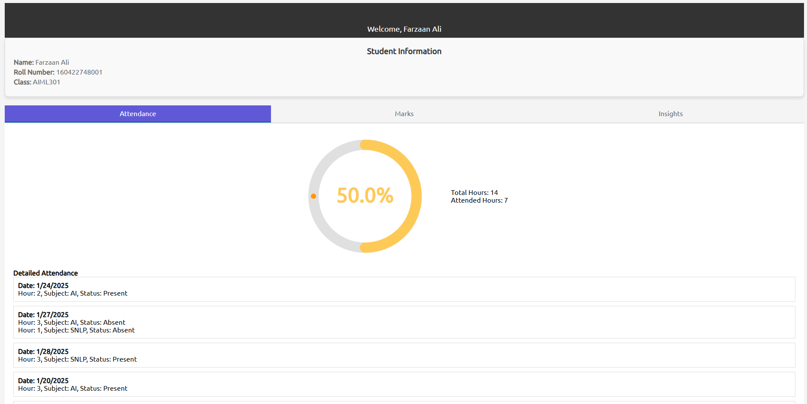
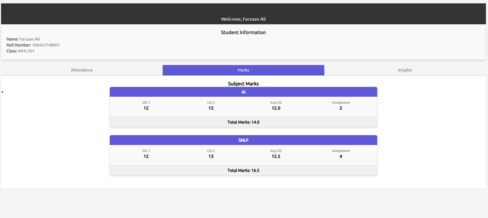
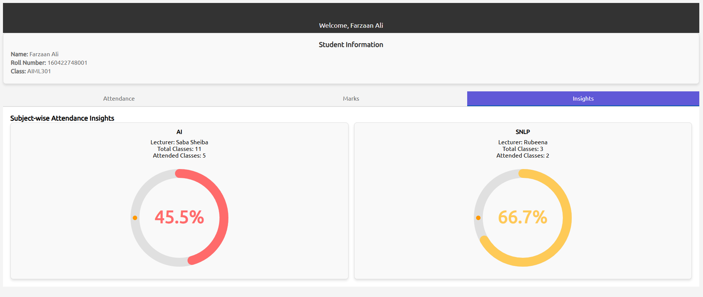

# Academic Management Portal

## Overview

The **Academic Management Portal** is a web-based system designed to streamline academic data management by providing dedicated dashboards for students, lecturers, and administrators. It enables real-time attendance tracking, marks management, and insightful analytics to improve academic oversight.


## Features

- **Student Dashboard:**
  - View personal details
  - Check daily attendance records and overall attendance percentage
  - Subject-wise attendance breakdown
  - View marks for each subject in real-time

- **Lecturer Dashboard:**
  - View teaching timetable
  - Manage student attendance for selected classes and dates
  - Upload and update student marks
  - Access performance insights, including attendance and marks analytics for classes taught

- **Admin Dashboard:**
  - Manage student, lecturer, and class records
  - Assign lecturers to subjects and classes
  - Monitor and track overall academic data

## Requirements

### Software Requirements:
- **Node.js** (Latest LTS version)
- **Express.js** (Web framework)
- **MongoDB** (Database)
- **EJS** (Template engine)
- **CSS** (For styling)

## Setup

1. Clone the repository:
   ```sh
   git clone <REPO_URL>
   cd academic-management-portal
   ```

2. Install dependencies:
   ```sh
   npm install
   ```

3. Configure MongoDB connection in `.env` file:
   ```sh
   MONGODB_URI=<your-mongodb-uri>
   ```

4. Start the server:
   ```sh
   nodemon src/index.js
   ```

## Usage

### Student Dashboard
- Login as a student to view attendance, marks, and personal details.





### Lecturer Dashboard
- Login as a lecturer to take attendance, upload marks, and view analytics.


### Admin Dashboard
- Login as an admin to manage users, subjects, and classes.


## Contributing

Contributions are welcome! Please submit a Pull Request with your changes.

## Copyright

This project is copyrighted and protected under intellectual property laws. Unauthorized use, reproduction, distribution, or modification of this project is strictly prohibited without explicit permission from the author.
